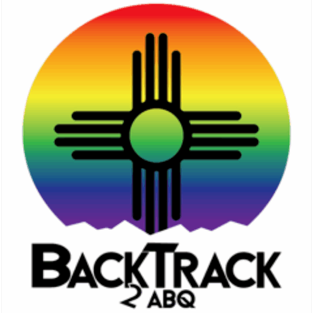

# Image variations

Visual-review fixture for `ZoomableImage.tsx`'s title-string directives — no
automated test asserts against this page's own rendering; it exists so a
reviewer can eyeball every combination at once. The caller headshot photo
is a real, clickable/zoomable image at each size; the event icon is a
small, decorative image that opts out of zoom/gallery entirely via
`no-zoom`, alone or paired with a size.

## Default (no title) — clickable, capped at the page's own width

## Size keywords — each still clickable/zoomable

### thumbnail

### small

### medium

### large

## A real tooltip still works — not a recognized directive

## `no-zoom` — not clickable, not in the page's image gallery

### no-zoom alone (natural size)

### thumbnail no-zoom

### small no-zoom

### medium no-zoom

### large no-zoom

## What to check

- Every image above except the six under "`no-zoom`" should show a zoom-in
  cursor and open the lightbox on click/tap.
- Opening the lightbox from any clickable image above and stepping through
  Next/Previous should visit only the OTHER clickable images on this page —
  the six `no-zoom` event-icon variants should never appear as a slide.
- The `no-zoom` images should show a normal (non-zoom) cursor and do
  nothing on click/tap.
- "A real tooltip still works" should show its text as an actual hover
  tooltip, not get consumed as a size/no-zoom directive.
